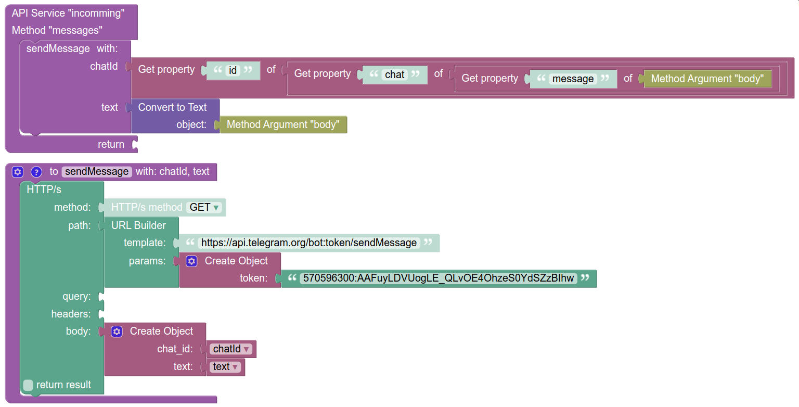

# Создание простого telegram бота, с использованием backendless

## О чем инструкция
Данный гайд описывает как создать и запустить простого телеграм бота
не арендуя при этом хостинг, не приобритая какие либо услуги и подписки для поддержки работы всего этого хозяйства в будущем.
Так же вам не придется осуществлять настройку всей серверной инфраструктуры, и еще не надо будет писать программный код:)

## Сам гайд

1. Создаем "тело" - telegram профиль бота;

    1.1. Открываем telegram messenger, жмакаем по кнопке нового сообщение и в строку поиска контакта вводим: **BotFather**;

    1.2. После открытия данного контакта и перехода в диалог с ним, нажать кнопку **start**;

    1.3. Далее отправляем сообщение с текстом `/newbot`;

    1.4. После чего от **BotFather** мы получим сообщения о том, что требуется отправить
    имя создаваемого бота и логин, поэтому удовлетворим эти желания, выбираем имя/логин и так же отправляем это сообщением в диалог;

    1.5. На этом все, самый первый шаг выполнен, профиль бота в telegram создан. Вы получите сообщение об успехе примерно такого вида:
    >Done! Congratulations on your new bot. You will find it at t.me/veryVerySimpleBot. You can now add a description, about section and profile picture for your bot, see /help for a list of commands. By the way, when you've finished creating your cool bot, ping our Bot Support if you want a better username for it. Just make sure the bot is fully operational before you do this.
    >
    >Use this token to access the HTTP API:
    >570596300:AAFuyLDVUogLE_QLvOE4OhzeS0YdSZzBIhw
    >
    >For a description of the Bot API, see this page: https://core.telegram.org/bots/api

    В сообщение об успехе так же будет приложен токен вашего бота, в данном случае, вот эта строка: **570596300:AAFuyLDVUogLE_QLvOE4OhzeS0YdSZzBIhw**

2.  Создаем "мозги" бота - наше api;

    2.1. Заходим на http://develop.backendless.com/registration, и регистрируем аккаунт(надо будет подтвердить почту);

    2.2. После перехода по ссылке, backendless потребует выбрать имя приложения, вы можете выбрать любое имя для него, оно не будет играть ни какой роли;

    2.3. Далее переходим в пункт меню **Business logic**;

    2.4. Во вкладке **API SERVICES** нажмите кнопку создания **+**,
    после чего выбирите вкладку **CODELESS** и в качестве имени сервиса напишите **incomming**;

    2.5. Далее будет предложено создать метод для этого сервиса, введите следующие значения:

    | Имя параметра      | Значение                                                          |
    | :----------------- | :----------------------------------------------------------------:|
    | **Method Name**    | messages                                                          |
    | **REST Operation** | POST                                                              |
    | **REST Route**     | /messages                                                         |
    | **parameter 1**    | **Name:** `body`, **Type:** `Any Object`, **required:** `выбрано` |

    2.6. После создания метода, перейдите во вкладку **CODELESS** и кликните по методу, который был создан.

    2.7. Теперь вы должны создать конструкцию такого вида:

    

    Первый блок у вас будет создан по умолчанию, а второй блок - это функция,
    найти этот блок можно в секции `SYSTEM->Functions`.

    API URL отправки сообщения: `https://api.telegram.org/bot<TOKEN БОТА ИЗ ДИАЛОГА С BotFather>/sendMessage`

    2.8. После чего нажимаем **DEPLOY MODEL**, и теперь наши мозги бота готовы.

3. Связываем "мозги и тело";

    3.1 В backendless заходим в **Business logic -> API SERVICES** (мы от сюда почти и не уходили относительно прошлого шага),
    кликаем по нашему методу messages, и видим зеленую строку с кнопкой **show full url**;

    3.2. Нажимаем эту кнопку и копируем урл, который развернулся, он будет имеет вид:
    `https://api.backendless.com/2171CA87-C595-1721-FF9A-BDF3AF6AE200/91EB7231-4F2B-53B0-FF66-9C2A95221100/services/incomming/messages`;

    3.3. Формируем урл запрос на регистрацию вебхука, по шаблону:
    `https://api.telegram.org/bot<TOKEN БОТА ИЗ ДИАЛОГА С BotFather>/setWebhook?allowed_updates=["message"]&url=<СКОПИРОВАННЫЙ ИЗ BACKENDLESS URL>`
    в моем случае урл будет выглядеть так:
    `https://api.telegram.org/bot570596300:AAFuyLDVUogLE_QLvOE4OhzeS0YdSZzBIhw/setWebhook?allowed_updates=["message"]&url=https://api.backendless.com/2171CA87-C595-1721-FF9A-BDF3AF6AE200/91EB7231-4F2B-53B0-FF66-9C2A95221100/services/incomming/messages`

    3.4. Скопируйте получившийся URL и вставьте его в браузер и нажмите Enter. После выполнения на странице должно будет отобразится следующее:
    `{"ok":true,"result":true,"description":"Webhook was set"}`;

    3.5. Если все так и произошло, добавьтe своего бота себе в контакты,
    и теперь на любое сообщение, которое вы ему отправите, он будет отвечать "сырыми" данными,
    которые приходят на backendless сервер от telegram.

## Полезные ссылки

 * Документация Telegram Bot API - https://core.telegram.org/bots/api
 * Пример запроса, приходящего в апи, от Telegram, после отправки сообщения боту - [telegramResponse](telegramResponse.md)
 * Документация Codeless - https://backendless.com/docs/codeless
 * Пример бота подписки на изменения цены объявления на n1.ru - [priceSubscriptionsBot/README.md](priceSubscriptionsBot/README.md)