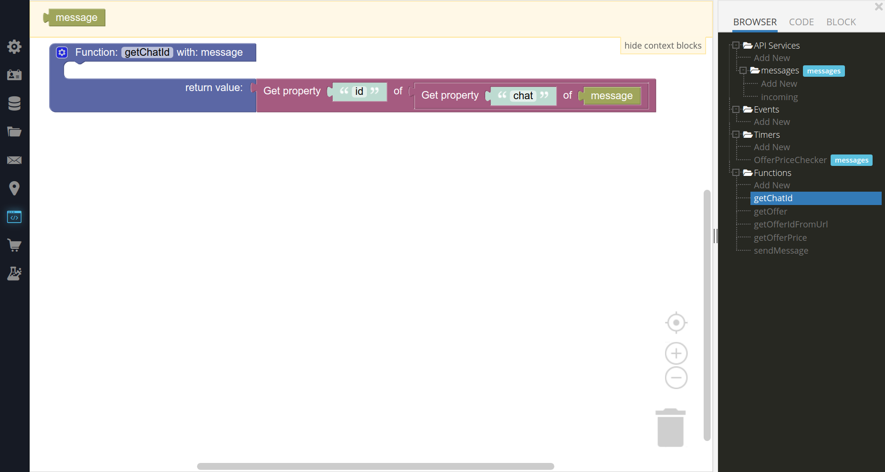
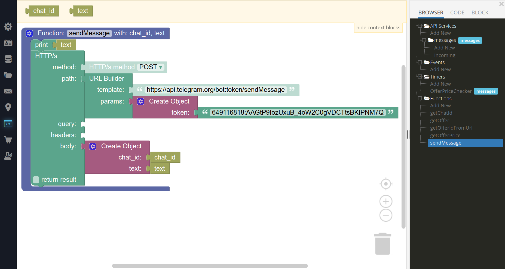
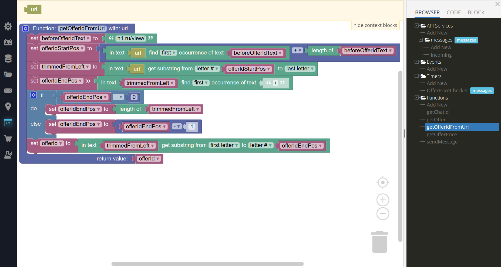
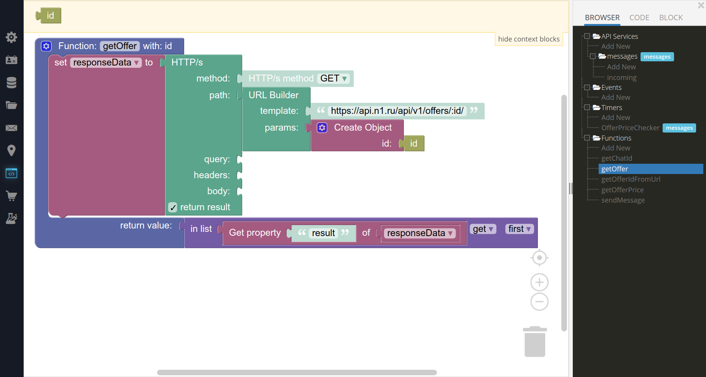
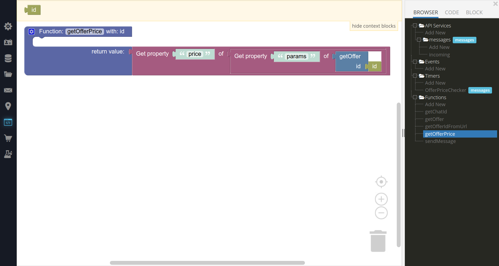
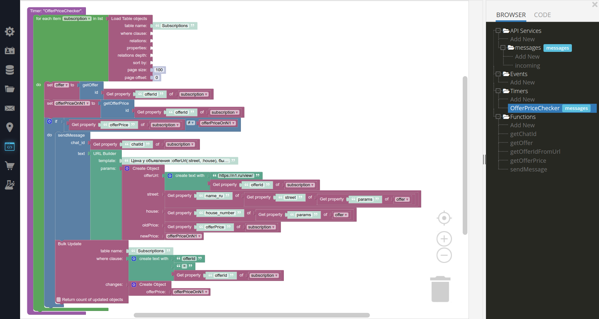
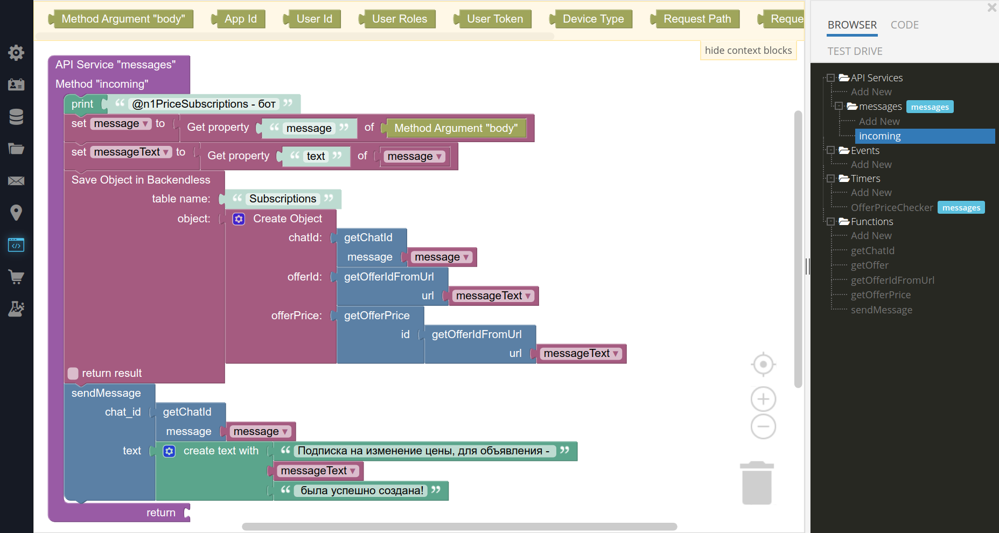
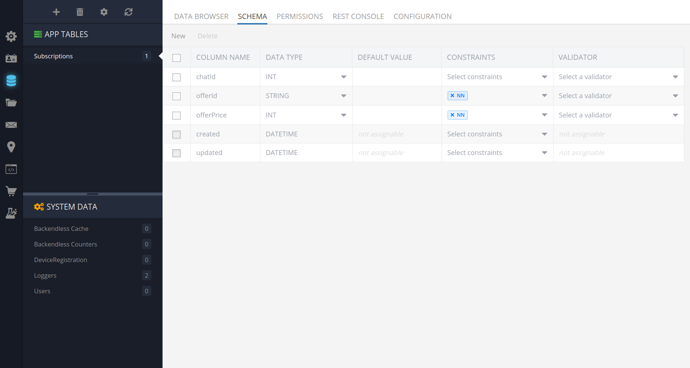
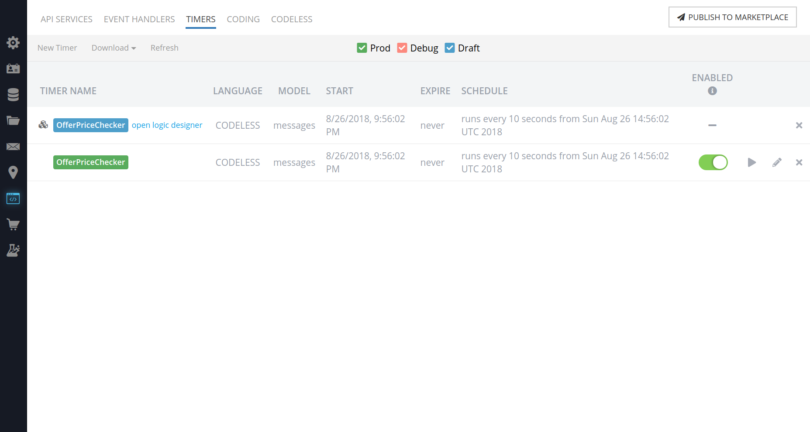

# "Исходники" n1PriceSUbscriptionsBot на codeless

Данный бот при получении сообщения с ссылкой на объявление, например - `https://novosibirsk.n1.ru/view/27028105/`,
сохраняет информацию о цене объявления, и при ее изменении, он уведомляет пользователя об этом.

## Функции хелперы

### getChatId - Выдерает идентификтаор чата, из данных, приходящих от телеграм

### sendMessage - Отправляет сообщение в телеграм

### getOfferIdFromUrl Вычленяем идентификатор объявления из урла

Смысл функции прост, чтобы вычленить id, нам надо найти cтартовую позиция подстроки `n1.ru/view/`,
после этого обрезаем ее слева, и далее находим первый символ `/` или если его нет, то позицией окончания строки,
будет длина этой строки.
Ну и все, берем substring и получаем идентификатор.  
(надеюсь понятно объяснил)

### getOffer - Ходим в n1 и получаем данные по объявлению

### getOfferPrice

## Главные методы

### offerPriceChecker (нажмите кнопку deploy, а не save, деплой сделает сразу запуск таймера)

### incoming - Обрабатывает все сигналы, которые приходят от серверов telegram(обрабатывает все входящие сообщения от пользователя)

## Остальное

### Структура таблицы Subscriptions - тут будут сохранятся все подписки на объявления

### Таймеры

